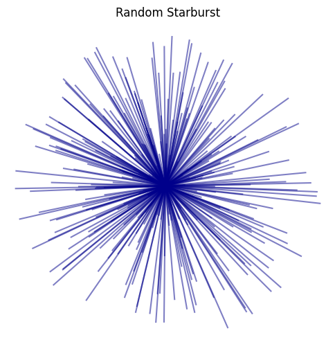
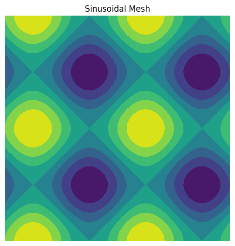

This notebook showcases how to create generative art using **Python** and **mathematical rules** — not by drawing manually, but by writing code.

We'll explore 4 core ideas:

1. Mathematical functions
2. Randomness and noise
3. Repetition and symmetry
4. Algorithmic patterns

```python
import numpy as np
import matplotlib.pyplot as plt
```

## 1️⃣ Mathematical Function – Lissajous Curve

This plot shows a basic sine wave. By changing the amplitude or frequency, you can generate various types of wave patterns.

```python
x = np.linspace(0, 2*np.pi, 1000)
y = np.sin(x) + 0.5 * np.cos(5*x)

plt.plot(x, y, color='crimson')
plt.title("Combined Sine and Cosine Wave")
plt.axis('off')
plt.show()
```

    

    

```python
x = np.linspace(0, 2*np.pi, 500)
y = np.sin(x) + 0.3 * np.sin(10*x)

plt.plot(x, y)
plt.fill_between(x, y, alpha=0.3)
plt.title("Generative Wave")
plt.show()
```

    

    

```python
# Lissajous Curve

t = np.linspace(0, 10*np.pi, 1000)
x = np.sin(3 * t)
y = np.cos(5 * t)

plt.plot(x, y, color='darkblue')
plt.axis('off')
plt.gca().set_aspect('equal')
plt.show()
```

    

    

```python
# Lissajous Curve
a = 5
b = 4
delta = np.pi / 2
t = np.linspace(0, 2 * np.pi, 1000)
x = np.sin(a * t + delta)
y = np.sin(b * t)

plt.figure(figsize=(6,6))
plt.plot(x, y, color='darkorange')
plt.axis('equal')
plt.axis('off')
plt.title("Lissajous Curve")
plt.show()
```

    

    

## 2️⃣ Randomness – Colorful Dot Scatter

```python
x = np.random.rand(500)
y = np.random.rand(500)

colors = np.random.rand(500)
sizes = 1000 * np.random.rand(500)

plt.scatter(x, y, c=colors, s=sizes, alpha=0.6, cmap='plasma')
plt.axis('off')
plt.show()
```

    

    

```python
pixels = np.random.rand(100, 100)

plt.imshow(pixels, cmap='plasma')
plt.axis('off')
plt.title("Random Noise Art")
plt.show()
```

    

    

Random Lines (Noise-based Brushstrokes)

```python
np.random.seed(1)
plt.figure(figsize=(8, 6))

for _ in range(100):
    x = np.random.rand(2)
    y = np.random.rand(2)
    plt.plot(x, y, alpha=0.3, linewidth=np.random.rand()*3, color=np.random.rand(3,))

plt.axis('off')
plt.title("Random Brushstroke Lines")
plt.show()
```

    

    

Starburst from Random Angles

```python
np.random.seed(2)
plt.figure(figsize=(6, 6))
center = (0, 0)

for _ in range(300):
    angle = np.random.uniform(0, 2*np.pi)
    length = np.random.uniform(0.1, 1)
    x = [0, length * np.cos(angle)]
    y = [0, length * np.sin(angle)]
    plt.plot(x, y, alpha=0.5, color='darkblue')

plt.axis('equal')
plt.axis('off')
plt.title("Random Starburst")
plt.show()
```

    

    

Random Walk (Drunken Artist)

```python
np.random.seed(42)
steps = 1000
x = np.cumsum(np.random.randn(steps))
y = np.cumsum(np.random.randn(steps))

plt.figure(figsize=(8, 6))
plt.plot(x, y, lw=1.5, alpha=0.8)
plt.title("Random Walk")
plt.axis('equal')
plt.axis('off')
plt.show()
```

    

    

Random Color Grid

```python
plt.figure(figsize=(6, 6))
grid_size = 10

for i in range(grid_size):
    for j in range(grid_size):
        color = np.random.rand(3,)  # RGB
        plt.gca().add_patch(plt.Rectangle((i, j), 1, 1, color=color))

plt.xlim(0, grid_size)
plt.ylim(0, grid_size)
plt.axis('off')
plt.gca().set_aspect('equal')
plt.title("Random Color Grid")
plt.show()
```

    

    

Noise-driven curves (Perlin-style)

```python
from scipy.ndimage import gaussian_filter1d

np.random.seed(0)
x = np.linspace(0, 10, 500)
y = np.random.randn(500)
y_smooth = gaussian_filter1d(y, sigma=10)

plt.figure(figsize=(10, 4))
plt.plot(x, y_smooth, lw=2, color='purple')
plt.title("Smooth Noise Curve (Perlin-like)")
plt.axis('off')
plt.show()
```

    

    

Fractal patterns with stochastic rules

```python
def draw_branch(x, y, angle, depth, branch_length):
    if depth == 0:
        return
    x2 = x + np.cos(angle) * branch_length
    y2 = y + np.sin(angle) * branch_length
    plt.plot([x, x2], [y, y2], color='brown', lw=depth/2)
    angle_variation = np.pi / 8
    draw_branch(x2, y2, angle - angle_variation * np.random.rand(), depth - 1, branch_length * 0.7)
    draw_branch(x2, y2, angle + angle_variation * np.random.rand(), depth - 1, branch_length * 0.7)

plt.figure(figsize=(6, 6))
draw_branch(0, -1, np.pi / 2, depth=8, branch_length=1)
plt.axis('off')
plt.title("Randomized Fractal Tree")
plt.show()
```

    

    

Random circles with varying opacity and position

```python
np.random.seed(3)
plt.figure(figsize=(6, 6))
for _ in range(200):
    x, y = np.random.rand(2)
    radius = np.random.rand() * 0.1
    alpha = np.random.rand()
    circle = plt.Circle((x, y), radius, color=np.random.rand(3,), alpha=alpha)
    plt.gca().add_patch(circle)

plt.xlim(0, 1)
plt.ylim(0, 1)
plt.axis('off')
plt.gca().set_aspect('equal')
plt.title("Floating Circles with Random Opacity")
plt.show()
```

    

    

## 3️⃣ Repetition and Symmetry – Polar Flower

Polar Flower (Rose Curve)

```python
# Symmetric pattern in polar coordinates
theta = np.linspace(0, 2 * np.pi, 1000)
r = np.cos(5 * theta)

x = r * np.cos(theta)
y = r * np.sin(theta)

plt.figure(figsize=(6,6))
plt.plot(x, y, color='crimson')
plt.axis('equal')
plt.axis('off')
plt.title("Symmetry: Polar Flower (5 petals)")
plt.show()
```

    

    

```python
fig, ax = plt.subplots()
for i in range(50):
    circle = plt.Circle((0.5, 0.5), 0.01 + i * 0.01, fill=False, color='teal', lw=0.8)
    ax.add_patch(circle)

ax.set_aspect('equal')
ax.axis('off')
plt.title("Concentric Circles")
plt.show()
```

    

    

```python
from PIL import Image, ImageDraw
from IPython.display import display

img = Image.new("RGB", (300, 300), "white")
draw = ImageDraw.Draw(img)

for i in range(0, 300, 10):
    draw.line((150, 150, i, 0), fill=(0, 100, 200))
    draw.line((150, 150, i, 300), fill=(200, 50, 100))
    draw.line((150, 150, 0, i), fill=(50, 200, 100))
    draw.line((150, 150, 300, i), fill=(255, 165, 0))

display(img)
```

    

    

Multiple Polar Flowers (Layered Symmetry)

```python
plt.figure(figsize=(6,6))

for k in range(2, 8):
    r = np.sin(k * theta)
    x = r * np.cos(theta)
    y = r * np.sin(theta)
    plt.plot(x, y, alpha=0.6)

plt.title("Multiple Polar Flowers")
plt.axis('equal')
plt.axis('off')
plt.show()
```

    

    

Logarithmic Spiral with Symmetry

```python
a = 0.1
b = 0.2
theta = np.linspace(0, 4 * np.pi, 1000)
r = a * np.exp(b * theta)

x = r * np.cos(theta)
y = r * np.sin(theta)

plt.figure(figsize=(6,6))
plt.plot(x, y, color='darkgreen')
plt.title("Logarithmic Spiral")
plt.axis('equal')
plt.axis('off')
plt.show()
```

    

    

## 4️⃣ Algorithmic Structure – Spiral Grid

```python
# Spiraling square grid
n = 300
theta = np.linspace(0, 10 * np.pi, n)
r = np.linspace(0.1, 1, n)

x = r * np.cos(theta)
y = r * np.sin(theta)

plt.figure(figsize=(6,6))
for i in range(n):
    plt.plot([0, x[i]], [0, y[i]], color=plt.cm.plasma(i/n), alpha=0.7)
plt.axis('equal')
plt.axis('off')
plt.title("Algorithmic Spiral Grid")
plt.show()
```

    

    

```python
# Distorted grid pattern using sine
x = np.linspace(0, 1, 100)
y = np.linspace(0, 1, 100)

for i in y:
    plt.plot(x, np.sin(10*x + 10*i)*0.05 + i, color='black', linewidth=0.7)

plt.axis('off')
plt.title("Wave-Distorted Grid")
plt.show()
```

    

    

Cellular Automata – Rule-Based Pattern (1D)

```python
def rule30(prev_row):
    next_row = np.zeros_like(prev_row)
    for i in range(1, len(prev_row)-1):
        left, center, right = prev_row[i-1], prev_row[i], prev_row[i+1]
        next_row[i] = left ^ (center or right)  # Rule 30 logic
    return next_row

size = 101
steps = 50
grid = np.zeros((steps, size), dtype=int)
grid[0, size // 2] = 1  # Initial condition

for i in range(1, steps):
    grid[i] = rule30(grid[i - 1])

plt.figure(figsize=(10, 5))
plt.imshow(grid, cmap='binary')
plt.title("Rule 30 – Cellular Automaton")
plt.axis('off')
plt.show()
```

    

    

L-Systems (Fractal Grammar) – Line Drawing

```python
def l_system(axiom, rules, iterations):
    for _ in range(iterations):
        axiom = ''.join(rules.get(c, c) for c in axiom)
    return axiom

def draw_l_system(instructions, angle=25, step=5):
    import math
    x, y = 0, 0
    angle_rad = math.radians(angle)
    stack = []
    direction = math.pi / 2
    xs, ys = [x], [y]

    for cmd in instructions:
        if cmd == 'F':
            x += step * math.cos(direction)
            y += step * math.sin(direction)
            xs.extend([x])
            ys.extend([y])
        elif cmd == '+':
            direction += angle_rad
        elif cmd == '-':
            direction -= angle_rad
        elif cmd == '[':
            stack.append((x, y, direction))
        elif cmd == ']':
            x, y, direction = stack.pop()
            xs.extend([None])  # break line
            ys.extend([None])

    plt.figure(figsize=(8, 8))
    plt.plot(xs, ys, color='forestgreen')
    plt.axis('equal')
    plt.axis('off')
    plt.title("L-System Tree")
    plt.show()

# Define axiom and rules
axiom = "F"
rules = {"F": "F[+F]F[-F]F"}
result = l_system(axiom, rules, iterations=4)
draw_l_system(result)
```

    

    

Recursive Squares (Subdivision Art)

```python
import random

def draw_recursive_squares(ax, x, y, size, depth):
    if depth == 0:
        return
    ax.add_patch(plt.Rectangle((x, y), size, size,
                               edgecolor='black', facecolor='none'))
    new_size = size / 2
    for dx in [0, new_size]:
        for dy in [0, new_size]:
            if random.random() > 0.5:
                draw_recursive_squares(ax, x + dx, y + dy, new_size, depth - 1)

fig, ax = plt.subplots(figsize=(6, 6))
draw_recursive_squares(ax, 0, 0, 1, 5)
plt.axis('equal')
plt.axis('off')
plt.title("Recursive Squares")
plt.show()
```

    

    

Spiral with Color Gradient

```python
plt.figure(figsize=(6, 6))
theta = np.linspace(0, 8 * np.pi, 1000)
r = np.linspace(0.1, 1, 1000)
x = r * np.cos(theta)
y = r * np.sin(theta)
plt.scatter(x, y, c=theta, cmap='hsv', s=2)
plt.axis('equal')
plt.axis('off')
plt.title("Spiral with Color Gradient")
plt.show()
```

    

    

Triangle Grid Pattern

```python
plt.figure(figsize=(6, 6))
for x in range(10):
    for y in range(10):
        if (x + y) % 2 == 0:
            points = [(x, y), (x+1, y), (x+0.5, y+0.87)]
        else:
            points = [(x, y), (x+1, y), (x+0.5, y-0.87)]
        triangle = plt.Polygon(points, color=np.random.rand(3,), edgecolor='black', linewidth=0.5)
        plt.gca().add_patch(triangle)
plt.xlim(0, 11)
plt.ylim(-1, 11)
plt.axis('equal')
plt.axis('off')
plt.title("Triangle Grid Pattern")
plt.show()
```

    /tmp/ipython-input-45-3691378934.py:8: UserWarning: Setting the 'color' property will override the edgecolor or facecolor properties.
      triangle = plt.Polygon(points, color=np.random.rand(3,), edgecolor='black', linewidth=0.5)

    

    

Spiral Circle Packing

```python
plt.figure(figsize=(6, 6))
n = 500
golden_angle = np.pi * (3 - np.sqrt(5))
for i in range(n):
    r = np.sqrt(i / n)
    theta = i * golden_angle
    x = r * np.cos(theta)
    y = r * np.sin(theta)
    circle = plt.Circle((x, y), 0.015, color=plt.cm.viridis(i/n))
    plt.gca().add_patch(circle)
plt.xlim(-1, 1)
plt.ylim(-1, 1)
plt.axis('equal')
plt.axis('off')
plt.title("Spiral Circle Packing")
plt.show()
```

    

    

Concentric Polygon Growth

```python
plt.figure(figsize=(6, 6))
for i in range(1, 15):
    theta = np.linspace(0, 2*np.pi, 7)  # 6 sides + close the loop
    r = i * 0.3
    x = r * np.cos(theta)
    y = r * np.sin(theta)
    plt.plot(x, y, color=plt.cm.plasma(i / 15))
plt.axis('equal')
plt.axis('off')
plt.title("Concentric Polygon Growth")
plt.show()
```

    

    

Rotating Grid Lines

```python
fig, ax = plt.subplots(figsize=(6, 6))
ax.set_aspect('equal')
ax.axis('off')

size = 10
spacing = 1
for x in np.arange(-size, size+1, spacing):
    for y in np.arange(-size, size+1, spacing):
        dx = x
        dy = y
        angle = np.arctan2(dy, dx)
        length = 0.8
        ax.plot([x - length*np.cos(angle), x + length*np.cos(angle)],
                [y - length*np.sin(angle), y + length*np.sin(angle)],
                color='black', linewidth=1)

plt.title("Grid of Rotating Lines")
plt.show()
```

    

    

```python
fig, ax = plt.subplots(figsize=(6, 6))
ax.set_aspect('equal')
ax.axis('off')
spacing = 1.0
for x in np.arange(-5, 5.1, spacing):
    for y in np.arange(-5, 5.1, spacing):
        angle = np.sin(x) + np.cos(y)
        dx = 0.4 * np.cos(angle)
        dy = 0.4 * np.sin(angle)
        ax.plot([x - dx, x + dx], [y - dy, y + dy], color='black', lw=0.8)
plt.title("Rotating Grid Lines")
plt.show()
```

    

    

Sinusoidal Mesh

```python
fig, ax = plt.subplots(figsize=(6, 6))
ax.set_aspect('equal')
ax.axis('off')
x = np.linspace(-2*np.pi, 2*np.pi, 40)
y = np.linspace(-2*np.pi, 2*np.pi, 40)
X, Y = np.meshgrid(x, y)
Z = np.sin(X) + np.cos(Y)
for i in range(Z.shape[0]):
    ax.plot(X[i], Z[i], color='blue', lw=0.5, alpha=0.7)
for j in range(Z.shape[1]):
    ax.plot(X[:, j], Z[:, j], color='red', lw=0.5, alpha=0.7)
plt.title("Sinusoidal Mesh")
plt.show()
```

    

    

```python
fig, ax = plt.subplots(figsize=(8, 6))
ax.set_aspect('equal')
ax.axis('off')

x = np.linspace(0, 4 * np.pi, 100)
y = np.linspace(0, 4 * np.pi, 100)
X, Y = np.meshgrid(x, y)
Z = np.sin(X) + np.cos(Y)

ax.contourf(X, Y, Z, cmap='viridis')
plt.title("Sinusoidal Mesh")
plt.show()
```

    

    

Fibonacci Spiral

```python
fig, ax = plt.subplots(figsize=(6, 6))
ax.set_aspect('equal')
ax.axis('off')

n = 200
golden_angle = np.pi * (3 - np.sqrt(5))
theta = np.arange(n) * golden_angle
r = np.sqrt(np.arange(n))
x = r * np.cos(theta)
y = r * np.sin(theta)

ax.scatter(x, y, c=theta, cmap='plasma', s=8)
plt.title("Fibonacci Spiral")
plt.show()
```

    

    


---

*** More advanced **

```python
from noise import pnoise2

width, height = 400, 400
scale = 100.0
img = np.zeros((width, height))

for i in range(width):
    for j in range(height):
        img[i][j] = pnoise2(i / scale, j / scale, octaves=6)

plt.imshow(img, cmap='magma')
plt.axis('off')
plt.show()
```


```python
gx, gy = np.gradient(img)
plt.streamplot(np.arange(width), np.arange(height), gx.T, gy.T, density=1, linewidth=0.3, color='k')
plt.axis('off')
plt.show()
```


```python
plt.imshow(img, cmap='magma', alpha=0.6)
plt.imshow(img.T, cmap='cividis', alpha=0.4)
plt.axis('off')
```


---

